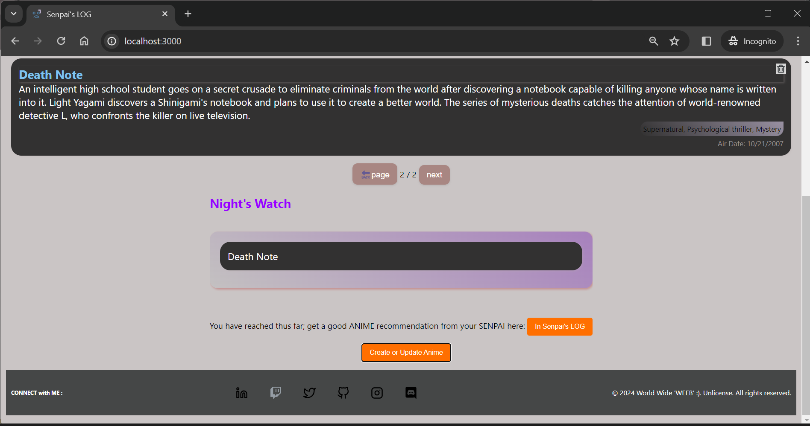

# Senpai's Log - Frontend
> **Note**  
> This directory features the frontend of the Senpai's LOG application - the public facing part of the **full-stack** web app. Read through its documentation to install dependencies.  


## Set-Up
> _Tip_: The frontend is designed to work with a [Flask-based Backend](../backend/flaskr/__init__.py). It does not load successfully if the backend is not working or not connected. You can **stand up the backend first**, and you can test it with [```curl```](https://curl.se/) to ascertain the `API` is  working correctly.

1. **`Node` and `NPM`**:  
This project depends on **Nodejs** and **Node Package Manager (NPM)** [`https://nodejs.com/en/download`](https://nodejs.org/en/download/) to manage [React](https://react.dev/) and related dependencies.

2. **Installing project dependencies**:  
NPM relies on the `package.json` file located in the senpais-log-frontend directory, which lists out dependencies.

```bash
# DO in a terminal/shell;
$ npm install
```

## Run:
> IN `development mode`  

```bash
# terminal/shell;
$ npm start
```

---
Open [http://localhost:3000](http://localhost:3000) to view the user interface the app in-browser.  
The page will reload when you make changes. You may also see any lint errors in the console.
<p align="center">
  
  
</p>
