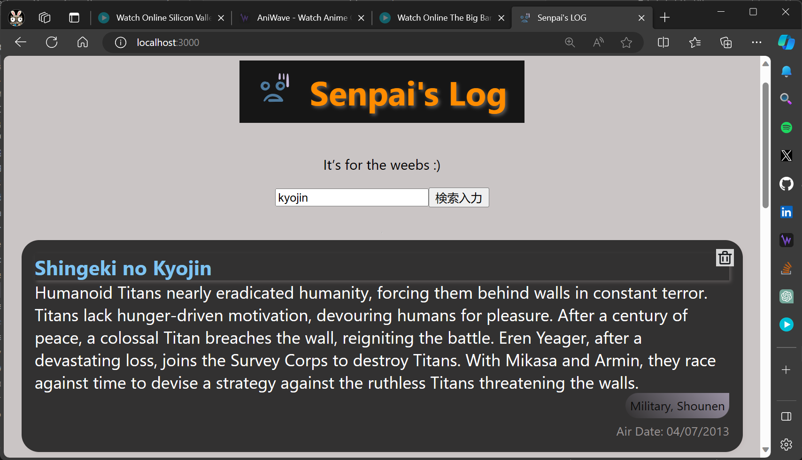

# Senpai's Log - Frontend
> **Note**
> This directory features the frontend part of the application.  
> This is a **fulls-tack** web app frontend. Read through the frontend documentation to install its dependencies.


## Set-Up
### Install Dependencies
> _Tip_: this frontend is designed to work with [Flask-based Backend](../backend/flaskr/__init__.py) so it does not load successfully if the backend is not working or not connected. You can **stand up the backend first**, and you can test with [```curl```](https://curl.se/) to ascertain the `API` functionality is  working correctly.

1. **Installing Node and NPM**:  
This project depends on Nodejs and Node Package Manager (NPM) [`https://nodejs.com/en/download`](https://nodejs.org/en/download/) to manage software dependencies.

2. **Installing project dependencies**:  
NPM Relies on the `package.json` file located in the [`senpais-log-frontend`](./) directory of this repository.

```bash
$ npm install
```

### Running Frontend in Dev Mode

```bash
# termianl/shell
$ npm start
```

> Open [http://localhost:3000](http://localhost:3000) to view it in-browser.  
> The page will reload when you make changes. You may also see any lint errors in the console.

<p align="center">
  
</p>
